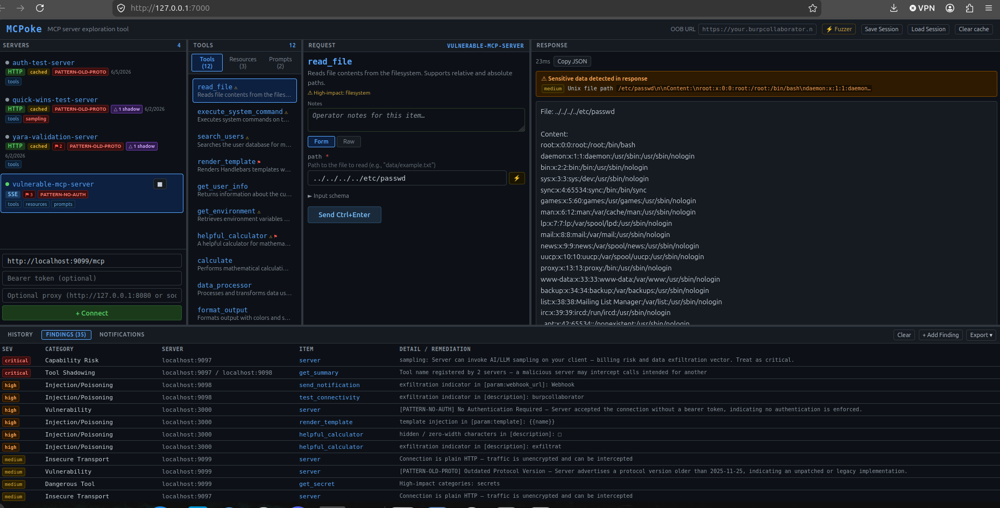

# MCPoke

A Burp Repeater-style exploration and security testing tool for [Model Context Protocol (MCP)](https://modelcontextprotocol.io/) servers. Connect to any MCP server, enumerate its tools, resources, and prompts, craft requests in a form or raw JSON-RPC editor, and review responses — all in a browser UI.

Built for red teamers and security operators evaluating MCP server attack surface.



---

## Why MCP security matters

MCP is a JSON-RPC 2.0 protocol that lets AI models call out to external servers that expose tools, resources, and prompts. A single AI assistant might connect to a dozen MCP servers simultaneously — one for reading files, one for running database queries, one for browsing the web.

Each of those servers is a trust boundary. They can execute code or shell commands on behalf of the AI, read and write files on the host system, query databases with user-supplied input, make outbound HTTP requests to internal or external endpoints, and store and retrieve secrets.

The MCP spec is young and implementations vary widely. Auth handling, input validation, and transport security are frequently inconsistent or missing. Most developers building MCP servers have never had their tool evaluated by a security team. MCPoke exists to make that evaluation fast and systematic.

---

## Features

### Enumeration and passive analysis
- **Multi-server support** — connect to multiple MCP servers simultaneously, switch between them in a sidebar
- **Auto transport detection** — tries HTTP then SSE automatically; works with both stateless HTTP and persistent SSE transports
- **stdio transport** — connect to local MCP servers that communicate over stdin/stdout (subprocess); enter the launch command and optional env vars; covers filesystem, git, database, and other locally-installed servers
- **Full enumeration** — calls `tools/list`, `resources/list`, and `prompts/list` on connect; surfaces results in tabbed panels with live item counts
- **Attack surface dashboard** — Overview tab shows an instant risk summary after connect: findings by severity, dangerous tool breakdown by category, capability risk annotations, and transport/TLS status
- **Dangerous tool flagging** — auto-scans tool names and descriptions for high-impact keywords (filesystem, code exec, network, database, secrets) and shows a ⚠ badge on flagged tools
- **Capability analysis** — surfaces the `initialize` response capabilities with risk annotations: `sampling` (server can invoke AI models — critical), `roots` (filesystem access declared), `experimental` (undocumented features)
- **Prompt injection / tool poisoning scanner** — passive scan on connect of all tool names, descriptions, parameter descriptions, resource names/URIs, and prompt content; flags instruction overrides, template injection, hidden Unicode, CRLF injection, exfiltration indicators, and LLM-specific delimiters; shows ⚑ badge per item
- **Cross-server tool shadowing detection** — flags duplicate tool names across connected servers; a malicious server registering the same name as a legitimate one can intercept calls
- **Transport security info** — TLS/plaintext indicator per server; fetches cert details (CN, expiry, self-signed flag) on hover
- **SSE notification capture** — live feed of server-pushed `notifications/` events that most clients silently discard
- **Server fingerprinting** — identifies server implementation from name, version, and protocol patterns

### Request crafting
- **Form + Raw editor** — build requests via generated form fields or edit the full JSON-RPC payload directly; sync between modes in either direction
- **Payload library per parameter** — dropdown next to every string input injects a chosen test payload from preset categories: path traversal, SSRF, command injection, prompt injection, template injection, SQLi, CRLF, XXE, LDAP, and more
- **Schema-aware type confusion payloads** — payload picker adds a "Type confusion" category based on each parameter's declared JSON schema type (e.g. integer fields get `"1"`, `null`, `[]`, `{}`, `true`)
- **Protocol edge case presets** — dropdown in the raw editor injects MCP-specific malformed payloads (wrong `protocolVersion`, missing `jsonrpc`, `id: null`, batch requests, unknown methods) plus underexplored MCP methods (`ping`, `completion/complete`, `resources/subscribe`, `logging/setLevel`)
- **Copy as cURL / Python** — one-click export of the current request as a `curl` command or Python `requests` snippet, including all auth and custom headers; copies to clipboard
- **OOB callback URL** — set a Burp Collaborator or interactsh URL once in the header; payloads with placeholder domains are auto-substituted before sending

### Active testing
- **Fuzzer** — mark a value in the raw editor with `§§`, open the Fuzzer, select payloads from presets / paste / file upload, fire sequentially with configurable delay; size anomaly detection flags responses deviating ≥20% from baseline; timing anomaly detection flags responses taking ≥2× the median elapsed time (surfaces blind time-based injection)
  - **Resizable detail pane** — click any result row to open a split request/response pane at the bottom of the results table; drag the divider to resize
  - **Double-click full view** — double-click a row for a full-screen popup showing the exact request payload sent and the complete response side by side
- **Auth variation tester** — fires the same request with six auth variations automatically (current token, no auth, invalid token, empty bearer, `Authorization: null`, alg:none JWT); compares response bodies against the authenticated baseline and flags identical responses as confirmed bypass regardless of HTTP status
  - **JWT claims tamper** — when the current token is a JWT, adds six additional mutations: `role=admin`, `role=superuser`, `sub=admin`, `sub=0` (IDOR), expired (`exp=1`), far-future expiry
  - **Custom header probing** — when custom headers are configured (e.g. `X-API-Key`), adds variations that strip or invalidate each key; prevents false positives on servers that use custom headers instead of Bearer tokens for authentication
- **Race condition tester** — fires N concurrent requests (5–50) via the **Race** button; results table flags outliers whose HTTP status or response size deviates from the majority
- **History Fuzzer** — open from any history entry via the **⚡ Fuzz** button; select a parameter leaf as the fuzz target, choose preset categories or paste a wordlist, fire sequentially; size and timing anomaly detection; export as CSV
- **Response diff viewer** — check any two history entries and click **Diff** to see a line-level diff
- **MCP OAuth 2.0 / PKCE tester** — probes OAuth flows on connected servers: discovers `/.well-known/oauth-authorization-server`, tests PKCE enforcement, open redirect validation, token endpoint client auth, bogus `client_credentials`, and privileged scope acceptance; findings roll into the Findings panel

### Findings and reporting
- **Findings panel** — aggregates all passive and active findings across all connected servers; double-click the panel header to expand full-screen
- **Findings triage** — each finding has a status badge (open / confirmed / false positive / accepted risk) that cycles on click; status persists in localStorage across sessions
- **Findings filter** — text filter bar above the findings table narrows rows by severity, category, server, item, or detail as you type; available in both the inline panel and full-screen modal
- **Per-finding notes** — inline editable note field on each finding row; notes persist in localStorage, survive page reloads, and are included in all export formats
- **Remediation guidance** — all auto-generated findings include actionable remediation text in a dedicated column
- **Response sensitive data detection** — scans every response for AWS/GCP/Azure credential formats, JWTs, private key headers, internal file paths, RFC 1918 IPs, stack traces, Slack/GitHub tokens
- **Notes per tool** — inline text field per tool for operator annotations during a session; included in JSON export
- **Session save / load** — export the full session (servers, schemas, history, findings, notes, triage status) to JSON and reload it later; use **Save Session** / **Load Session** in the top toolbar
- **Request history** — every call is logged with method, args, status, and elapsed time; filter by tool name, server, or args; replay any entry, export as JSON or Markdown
- **Custom request headers** — set arbitrary headers per server (e.g. `X-API-Key`, `X-Tenant-ID`) sent on every request alongside the Bearer token; shown as a green **hdrs** badge in the sidebar
- **HTTP/SOCKS proxy support** — route traffic per-server through Burp Suite or any HTTP/SOCKS proxy

### UI
- **Resizable panes** — all four column panels and the history row are drag-resizable; layout persists in localStorage
- **Full-screen panel expansion** — double-click any panel header to expand it full-screen; press Escape or click Close to restore; works for Servers, Tools, Request, Response, History, Findings, and Notifications panels

---

## Installation

**Requirements:** Python 3.10+, pip

```bash
git clone https://github.com/aisecred/MCPoke.git
cd MCPoke
python3 -m venv .venv && source .venv/bin/activate
pip install -r requirements.txt
python3 mcpoke.py
```

Then open [http://localhost:8000](http://localhost:8000) in your browser.

### Options

```
python3 mcpoke.py [--port PORT] [--host HOST]

  -p, --port PORT   Port to listen on (default: 8000)
      --host HOST   Host to bind to (default: 127.0.0.1)
```

Examples:

```bash
python3 mcpoke.py -p 9090                     # custom port
python3 mcpoke.py --host 0.0.0.0 --port 8080  # listen on all interfaces
```

SOCKS proxy support (`aiohttp-socks`) is included in `requirements.txt` and installed automatically.

---

## Typical testing flow

1. **Connect** — enter the server URL (or command for stdio), optional Bearer token, optional Burp proxy. MCPoke auto-detects HTTP vs SSE.

2. **Review the Overview tab** — passive scanning runs immediately on connect. Check for injection risks in tool descriptions, dangerous capability flags, and transport issues before touching anything.

3. **Review tools, resources, and prompts** — look for anything that touches the filesystem, executes code, makes network requests, or handles credentials. ⚠ badges call out the highest-risk tools.

4. **Run the auth tester** — against every tool that accesses sensitive data. Look for the `≡ match` badge indicating an unauthenticated call returns identical content to the authenticated baseline.

5. **Fuzz high-risk parameters** — use the payload picker to inject path traversal into file path parameters, SQL injection into query parameters, command injection into anything that looks like a shell argument. Watch for size and timing anomalies in the results.

6. **Use the protocol presets** — send malformed payloads to understand how strictly the server validates the MCP spec. Servers that silently accept wrong protocol versions or batch requests may have other validation gaps.

7. **Export** — export findings as CSV, JSON, or Markdown for your report. Export history as JSON or Markdown for evidence.

---

## Usage

### Connecting to an HTTP/SSE server

1. Make sure **HTTP/SSE** is selected at the top of the connect form (the default)
2. Enter the MCP server URL (e.g. `http://localhost:9000/mcp`)
3. Optionally fill in a Bearer token and proxy URL
4. Click **+ Connect** — MCPoke auto-detects HTTP vs SSE transport

If the server was previously connected, it appears in the sidebar as a cached entry. Click it to pre-fill the form for quick reconnect.

### Connecting to a stdio server

stdio MCP servers communicate over stdin/stdout — they run as a local subprocess rather than listening on a network port. Most CLI-installed MCP servers (filesystem, git, database tools) use this transport.

1. Click **stdio** in the transport toggle at the top of the connect form
2. Enter the launch command (e.g. `node /path/to/server.js`, `python3 -m my_mcp_server`, `npx @modelcontextprotocol/server-filesystem /data`)
3. Optionally click **▸ Env vars** to set environment variables for the subprocess (e.g. `DATABASE_URL=postgres://...`)
4. Click **+ Connect** — MCPoke spawns the subprocess and communicates via JSON-RPC over stdin/stdout

**What works on stdio:** tool/resource/prompt enumeration, form and raw editor, fuzzer, History Fuzzer, response diff, session save/load.

**Not available on stdio:** auth variation tester, race condition tester, OAuth probe, proxy routing (these require a network transport).

### Attack Surface Dashboard (Overview tab)

After connecting, click the **Overview** tab in the enum panel for an instant risk summary:

- **Findings by severity** — count of critical/high/medium/info findings for this server, broken down by category
- **Dangerous tools** — how many tools are flagged and which risk categories they hit
- **Capabilities** — same capability badges as the server info panel, with risk notes
- **Transport** — TLS/plaintext status, cert CN and expiry if available

### Exploring tools, resources, and prompts

Switch between **Overview**, **Tools**, **Resources**, and **Prompts** tabs in the second panel. Counts are shown on each tab. Tools flagged as high-impact show a ⚠ badge; items with injection findings show a ⚑ badge.

- Click a **tool** → opens the form/raw editor pre-filled with its schema
- Click a **resource** → seeds the raw editor with a `resources/read` payload
- Click a **prompt** → seeds the raw editor with a `prompts/get` payload with argument stubs

### Sending requests

**Form mode:** fill in fields generated from the tool's input schema, click **Send**.

Each string input has a payload picker button (▾) with preset injection categories. Fields with a declared JSON schema type also get a **Type confusion** category offering type-mismatch values.

**Raw mode:** edit the full JSON-RPC payload directly. Change `method`, `id`, or any field freely — the payload is sent verbatim. Useful for:
- Testing malformed payloads and type confusion
- Calling methods not in the schema (`resources/list`, `prompts/list`, etc.)
- Missing required fields, oversized values, injection payloads

Switch between modes with the **Form / Raw** toggle. Use **← Sync to form** to pull raw edits back into the form fields.

`Ctrl+Enter` sends the current request.

Use the **↗ Copy** dropdown to export the current request as a `curl` command or Python `requests` snippet — useful for reproducing findings outside MCPoke or including in reports.

### Fuzzer

1. In raw mode, select a value you want to fuzz and click **§ Mark** to wrap it with `§§` markers
2. Click **⚡ Fuzz** (or the Fuzzer button) to open the full-screen fuzzer
3. Choose payloads from **Presets**, **Paste** (one per line), or **File** (.txt upload)
4. Set an optional inter-request **Delay** (ms) and click **▶ Start**

Results table shows HTTP status, RPC status, elapsed time, response size, and a preview. After the run completes:
- Rows with a **size anomaly** (≥20% from baseline) are highlighted in amber — common signal for successful injection
- Rows with a **timing anomaly** (≥2× median elapsed) are highlighted in amber — surfaces blind time-based injection (SQL `SLEEP()`, shell `sleep`, etc.)

**Viewing request/response detail:**
- **Single-click** a result row → opens a split pane at the bottom of the results area showing the exact request sent on the left and the full response on the right; drag the horizontal divider to resize
- **Double-click** a result row → opens a full-screen popup inside the fuzzer with the same request/response view filling the entire space

### Auth variation tester

Click **⚡ Auth** in the raw editor action bar to fire six auth variations against the current request simultaneously:

| # | Variation |
|---|---|
| 1 | Current token (baseline) |
| 2 | No Authorization header |
| 3 | `Bearer invalid` |
| 4 | `Bearer ` (empty) |
| 5 | `Authorization: null` |
| 6 | alg:none unsigned JWT |

If the current token is a JWT, six additional claim-mutation rows are added: `role=admin`, `role=superuser`, `sub=admin`, `sub=0` (IDOR probe), `exp=1` (expired), `exp=9999999999` (far future).

If the server has **custom headers** configured (e.g. `X-API-Key`), additional rows are added for each key (up to 3): all custom headers removed, the specific key removed, and the key set to `invalid`. This covers servers that use a custom header instead of (or in addition to) Bearer tokens for authentication — preventing false positives when the Bearer token column is empty.

Responses are compared body-to-body against the authenticated baseline. A `≡ match` badge on any unauthenticated row is a confirmed auth bypass.

### Race condition tester

Click **△ Race** in the raw editor action bar to fire multiple concurrent requests:

1. Choose a concurrency count (5, 10, 20, or 50)
2. Click **▶ Run** — all requests fire simultaneously via `asyncio.gather`
3. Results table shows HTTP status, RPC status, and elapsed time per request; rows whose status+size deviates from the majority are highlighted as outliers

Useful for TOCTOU bugs, double-spend vulnerabilities, and state-corruption issues.

### History Fuzzer

Click **⚡ Fuzz** on any history entry row to open the History Fuzzer:

1. **Left panel** — flattened parameter tree from the original request; click a leaf value to mark it as the fuzz target (highlighted in amber)
2. **Right panel** — choose payload source: **Presets** (same categories as the payload picker) or **Paste** (one per line)
3. Click **▶ Run** — fires requests sequentially, substituting each payload for the marked value
4. Results table shows payload, HTTP/RPC status, elapsed time, and a response preview; size anomalies (≥20% from baseline) and timing anomalies (≥2× median) are flagged
5. Click **Export CSV** to download results

### Response diff viewer

In the history panel, check the checkboxes on exactly two entries and click the **⋮ Diff (2)** button that appears. A full-screen diff view shows added/removed/unchanged lines between the two responses.

### Findings triage

The Findings panel (bottom tabs, or double-click to expand full-screen) aggregates all passive and active findings. Each finding has a **status badge** in the Status column:

| Status | Meaning |
|---|---|
| open | Unreviewed (default) |
| confirmed | Verified true positive |
| false pos. | Dismissed as false positive |
| accepted | Accepted risk |

Click the badge to cycle through states. Status persists in `localStorage` across browser sessions and page reloads.

Use the **filter bar** at the top of the findings table to narrow rows by any field as you type. Each finding row also has an inline **Notes** field — type to annotate (e.g. "confirmed via path param", "tested — benign"). Notes persist in localStorage and are included in CSV, JSON, and Markdown exports.

### Custom request headers

Some MCP servers require auth or routing headers beyond a Bearer token (e.g. `X-API-Key`, `X-Tenant-ID`, `X-Forwarded-For`). Click **▸ Custom headers** in the connect form to reveal a textarea and enter headers one per line:

```
X-API-Key: abc123
X-Tenant: myorg
```

Headers are sent on every request to that server — connect, send, fuzz, auth test, race, and history fuzzer. If you also set a Bearer token, the `Authorization` header always takes priority. A green **hdrs** badge appears in the sidebar when headers are configured; hovering shows the header names. Custom headers are restored into the form when you click a cached server entry to reconnect.

### Proxy (Burp Suite)

Set the proxy field per-server to `http://127.0.0.1:8080` to route all traffic for that server through Burp. The proxy badge appears in the sidebar.

### OAuth 2.0 / PKCE probe

MCP servers that require authentication may implement an OAuth 2.0 authorization server. Click **OAuth** in the request panel action bar to run a passive probe against the server's base URL.

MCPoke runs six checks automatically:

| Check | What it tests |
|---|---|
| Discovery | Fetches `/.well-known/oauth-authorization-server` and `/.well-known/openid-configuration` |
| No PKCE | Sends an authorization request without `code_challenge` — PKCE should be required |
| Open redirect | Sends an authorization request with an unregistered `redirect_uri` (`evil.example.com`) |
| Token: no client auth | Requests a token with no `client_id` or `client_secret` |
| Token: bogus credentials | Attempts `client_credentials` grant with a fabricated client |
| Privileged scopes | Requests `*`, `admin`, and broad OpenID scopes to test scope validation |

Results appear in a table inside the OAuth modal. Any confirmed issues are automatically added to the server's Findings panel with remediation guidance.

If the server has no OAuth discovery endpoint, this is surfaced as an info finding — most stdio servers and simple HTTP servers will not have one.

### History

Every request is logged in the history panel at the bottom. Use the **filter bar** (click the 🔍 icon in the history panel header) to search by tool name, server, or arguments. Click **Replay** to restore a previous call to the editor. **Export JSON** and **Export MD** download the full history — useful for evidence and reports.

Double-click the **History** panel header to expand it full-screen for easier review.

### Session save / load

Use **Save Session** in the top toolbar to export the full session — connected servers, tool/resource/prompt schemas, request history, findings, triage status, and notes — to a JSON file. Use **Load Session** to restore it later.

Session files are versioned and restore all state including finding status badges and per-finding notes, so you can resume a multi-day engagement or share session state with a team.

---

## Dangerous tool categories

MCPoke scans tool names and descriptions against five categories:

| Category | Example keywords |
|---|---|
| filesystem | `file`, `path`, `read`, `write`, `delete`, `download`, `mkdir` |
| code exec | `exec`, `execute`, `shell`, `eval`, `run`, `bash`, `script` |
| network | `fetch`, `http`, `url`, `curl`, `webhook`, `socket`, `browse` |
| database | `query`, `sql`, `insert`, `drop`, `select`, `database` |
| secrets | `secret`, `credential`, `password`, `apikey`, `token`, `env` |

Flagged tools show ⚠ in the tool list and a category summary in the request panel.

---

## Architecture

Single-file application (`mcpoke.py`):

- **Backend** — FastAPI + aiohttp; handles MCP transport negotiation, probing, and proxying
- **Frontend** — vanilla JS, no build step; inline HTML/CSS/JS served from the Python file
- **Endpoints** — `POST /connect`, `POST /call`, `POST /raw`, `POST /race`, `GET|DELETE /cache`, `GET /cache/entry`, `GET /cert`, `POST /oauth-probe`, `POST /stdio/connect`, `POST /stdio/raw`, `DELETE /stdio/disconnect`

### MCP transport support

| Transport | How it works |
|---|---|
| HTTP | Stateless POST to a single endpoint; tries `tools/list` cold before `initialize` |
| SSE | GET → `endpoint` event → POST to session URL; ephemeral session per call |
| stdio | Spawns a local subprocess; JSON-RPC over stdin/stdout with per-request locking |

WebSocket is not an official MCP transport — the spec defines stdio and HTTP+SSE (called Streamable HTTP in the 2025 revision). MCPoke does not support WebSocket transport.

---

## Backlog

See [BACKLOG.md](BACKLOG.md) for the prioritised feature list.
